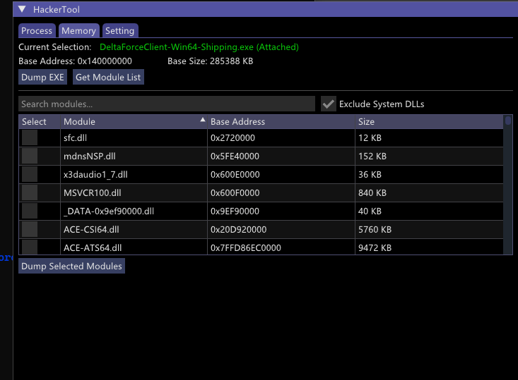

# DMA Memory Tool

[中文文档](README-CN.md) 

DMA (Direct Memory Access) tool
Utilizes direct memory access technology to obtain the memory data of the target machine process. 

## Functional Features
- 💾 Process enumeration and memory area dump
- 📊 Visual design and elegant LOG

## Applicable Scenarios
- 🔍 Can be used when you don't have a driver and the target process is protected, making it impossible to dump the memory
- 🛡️ Security: Uninvasive


<<<<<<< HEAD
 
=======
 
>>>>>>> a8aa670f97a4dba7b0a0fa6f34e31177be22b923
 


## Technical stack
```bash
C++20 or later versions
```

## Quick Start
Compilation Requirements

```bash
Visual Studio 2022
Windows 11 SDK (10.0.22000.0)
```

## Installation Steps
Clone the repository:

```bash
git clone https://github.com/yourusername/DMA-Memory-Tool.git
```

project structure
```info

DMA-Memory-Tool/
├──hacktool/
├── source/                  # User interface
│   ├── toolmain             # Main window logic
│   └── display/             # Dx11 resource files
├── support/                 # Support files 
│   ├── ImGui
│   ├── Memory
│
└──  # Visual Studio Solution
├── README.md                    # This file └── Process.sln

```

Credits and Acknowledgements
This project was partially implemented by referring to/using the following resources:

DMALibrary: https://github.com/Metick/DMALibrary
MemProcFS: https://github.com/ufrisk/MemProcFS
Dear ImGui: https://github.com/ocornut/imgui
DumpMemoryFunction: https://github.com/idkfrancis/DMA-ProcessDumper

License Agreement
This project is licensed under the Apache 2.0 license - for details, please refer to the LICENSE file.
